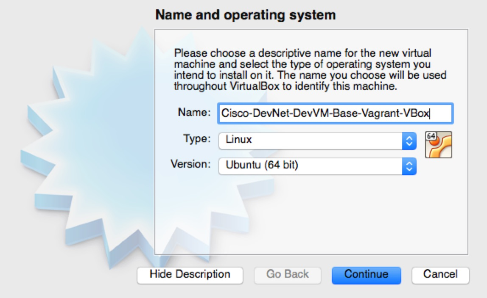

Welcome to the Development VMs for DevNet technologies project.

This project contains a variety of build scripts and Vagrant files for
creating Vagrant boxes. Pre-built OVAs for those boxes are available for download from
DevNet as described in this community:

https://communities.cisco.com/community/developer/dev-vm

If you want to build your own box, read on.

# How to Build Vagrant Boxes

Building Vagrant boxes, especially for multiple providers, is a fiddly
business. The tech works, as exhibited here, but quite how, why and
under which circumstances, required a bit of investigation. For the
sake of posterity, and do I don't forget, I have provided notes of how
this all came together here.

If you are interested in the details, read on. If you just want to up
the boxes, then go [here](upping_the_boxes.md)

## Why Different Providers?

In this case, where we have two VM flavours for VirtualBox and VMware,
the main motivation is that each VM flavour has different helper
utillities. VBox Guest additions  in the the case of VirtualBox, and
VMWare tools in the case of VMware.

In *should* be possible to create a single VM OVA that has both the
VBox Guest Additions and VMware tools installed, and then to use that
in either VBox, or one of the VMware options (Fusion, Player,
Workstation, ESXi and, potentially, so on).

I have tried that with a VM created in VBox, exported to OVA and
imported into Fusion. It *seemed* to be fine, but I did not test
exhaustively. For reasons based on, frankly, instinct and, maybe,
superstition, I just suspect that having both toolsets on the same VM
might be a bad idea.

In any case, a variety of other factors make that single source
approach non-workable/undesirable. Firstly, I
prefer to work with Fusion as a tool for creating VMs. It is just
nicer to use than VBox (many VBox fans out there may beg to differ I know, but this is about
what *I* prefer).

If one starts with a VM in Fusion, exports to an OVA, and then seeks
to import to VBox, one hits this issue with the disk
controllers:

https://forums.virtualbox.org/viewtopic.php?f=8&t=61624

I have tried changing the disk driver in the Fusion VM, exporting the
result to an OVA and importig into VBox, but that does not seem to
work with either the SATA or IDE controller optios in Fusion. C'est la
vie. 

## How Does One Create a VBox VM from a VMware VM?

The concept is simple, in that one creates a VBox VM of the given
target type, i.e. Ubuntu, *without* a disk, and then one clones the
disk from the VMware VM to use with the VBox VM. Then one uninstalls
vmware tools and installs the VBox helper. This explained in detail
below.

I used this tutorial as a guide: http://www.dedoimedo.com/computers/virtualbox-clone.html

1. Create the VBox VM

Create a new VM as illustrated below. There is nothing new or
different at this step.

 

2. Clone the HD from the VMware Fusion VM

``` bash
$ VBoxManage clonehd ~/Documents/Virtual\ Machines.localized/Cisco-DevNet-DevVM-Base-Vagrant-VMware.vmwarevm/Cisco-DevNet-DevVM-Base-Vagrant-VMware-disk1-cl1.vmdk ~/VirtualBox\ VMs/Cisco-DevNet-DevVM-Base-Vagrant-VBox/Cisco-DevNet-DevVM-Base-Vagrant-VBox-disk1-cl1.vmdk 
0%...10%...20%...30%...40%...50%...60%...70%...80%...90%...100%
Clone hard disk created in format 'VMDK'. UUID: 5cc62468-beaa-4160-adef-91859b8a3ea3
```
3. Choose the Cloned Disk for the New VM

Rather than create a new disk for the new VM, choose the disk
just cloned from the VMware Fusion VM.

 

4. Remove VMware Tools and Install VBox Guest Additions

Start the VBox VM and log in as cisco-devnet. Note that you will be
forced to change the password at this first login, so you will need to
reset it back to the default later.

Bring up a
terminal, then do the following. Note that there is no copy-and-paste
from the host to the VM available yet. The password for the vagrant
user is "vagrant".

```bash
$ su - vagrant
$ cd vmware-tools-distrib/bin
$ sudo ./vmware-uninstall-tools.pl
$ cd
$ sudo rm -rf vmware-tools-distrib/bin
```
Then install Guest Additions via the Devices Menu.

5. Reset Password and Logout

The default password for the cisco-devnet user is "CISCO-DEVNET", so
that needs to be reset with the `passwd` command:

## Packaging Boxes

Packaging boxes varies depending on the provider.

### VirtualBox

The simple case is the VBox (virtualbox) provider, as that is the
Vagrant default and so built into the framework. Given the VBox VM
created above, one would use the commands below on OSX:

```bash
$ vagrant package --base Cisco-DevNet-DevVM-Base-Vagrant-VBox --output
devnet-dev-base-vbox.box

==> Cisco-DevNet-DevVM-Base-Vagrant-VBox: Attempting graceful shutdown of VM...
...
==> Cisco-DevNet-DevVM-Base-Vagrant-VBox: Forcing shutdown of VM...
==> Cisco-DevNet-DevVM-Base-Vagrant-VBox: Exporting VM...
==> Cisco-DevNet-DevVM-Base-Vagrant-VBox: Compressing package to:
.../devnet-dev-base-vbox.box
```

An alternative approach to packaging, that one can use when one has a
running VM 'up'ed from a Vagrant box, which one has modified, is this:

```bash
$ vagrant package --output devnet-dev-base-vbox.box
==> default: Attempting graceful shutdown of VM...
==> default: Clearing any previously set forwarded ports...
==> default: Exporting VM...
==> default: Compressing package to: .../git/devnet-dev-vms/devnet-dev-base-vbox/devnet-dev-base-vbox.box
```

Note that this example is in the git directory as that is where the
Vagrantfile is. The box file should *not* be pushed to git, it should
be added locally, or at https://atlas.hashicorp.com, and then deleted.

Having created the box package, one should see something like:

```bash
$ ls -la devnet-dev-base-vbox 
-rw-r--r--  1 ...  staff  3793457667  2 Jul 11:26 devnet-dev-base-vbox.box
```

Then one can add the box locally for testing like this (note the
--force that allows one to do this as often as one needs to):

```bash
$ vagrant box add --force --name devnet-dev-base-vbox devnet-dev-base-vbox.box
==> box: Adding box 'devnet-dev-base-vbox' (v0) for provider: 
    box: Downloading: file:///.../git/devnet-dev-vms/devnet-dev-base-vbox/devnet-dev-base-vbox.box
==> box: Successfully added box 'devnet-dev-base-vbox' (v0) for 'virtualbox'!
```
To then use the local box, given a suitable [Vagrantfile](devnet-dev-base-vbox/Vagrantfile), one does this:

```bash
$ vagrant up --provider virtualbox
Bringing machine 'default' up with 'virtualbox' provider...
==> default: Importing base box 'devnet-dev-base-vbox'...
```

Or one can do this:

```bash
$ vagrant init devnet-dev-base-vbox
$ vagrant up --provider=virtualbox
```

### VMware

The [vmware provider(s)](http://www.vagrantup.com/vmware) have to be
[purchased](http://www.vagrantup.com/vmware#buy-now) before one can
use them.

The packaging process for VMware based boxes is entirely manual. The
steps here are derived from these [instructions](http://docs.vagrantup.com/v2/vmware/boxes.html).

The files that are strictly required for a VMware machine to function
are: nvram, vmsd, vmx, vmxf, and vmdk files, as well as a metadata.json file with these contents:

```python
{
  "provider": "vmware_desktop"
}
```
Then, for a VMware Fusion VM called
"Cisco-DevNet-DevVM-Base-Vagrant-VMware", one can follow these steps,
*when the VM has been shutdown* (file names may differ):

```bash
$ cd ~/Documents/Virtual\ Machines.localized/Cisco-DevNet-DevVM-Base-Vagrant-VMware.vmwarevm
$ /Applications/VMware\ Fusion.app/Contents/Library/vmware-vdiskmanager -d Cisco-DevNet-DevVM-Base-Vagrant-VMware-disk1-cl1.vmdk
$ /Applications/VMware\ Fusion.app/Contents/Library/vmware-vdiskmanager -k Cisco-DevNet-DevVM-Base-Vagrant-VMware-disk1-cl1.vmdk
$ rm *.plist
$ rm *.log
$ rm -rf *.lck
$ tar cvzf devnet-dev-base-vmware.box ./*
$ vagrant box add --force --name devnet-dev-base-vmware
devnet-dev-base-vmware.box
...
```

To then use the local box, given a suitable
[Vagrantfile](devnet-dev-base-vmware/Vagrantfile), one does this:

```bash
$ vagrant up --provider=vmware_fusion
```

Or one can do this:

```bash
$ vagrant init devnet-dev-base-vmware
$ vagrant up --provider=vmware_fusion
```

## Adding Boxes to Atlas

The devnet-dev-base-vbox is available at: https://atlas.hashicorp.com/CiscoDevNet/boxes/devnet-dev-base-vbox

The devnet-dev-base-vmware is available at:
https://atlas.hashicorp.com/CiscoDevNet/boxes/devnet-dev-base-vmware

In order to get those boxes there, one has to add boxes via the [web
UI](https://atlas.hashicorp.com/boxes/new), or use
[Packer](https://atlas.hashicorp.com/tutorial/packer-vagrant).

Note that uploading a box does not release it, so one needs do make
sure that one explicitly releases the box, via "Edit" and "Release version".

To test whether that has worked, one needs to delete the local copy of
the boxes that one has created so that the box will be downloaded as
it won't be found locally, like this (this will, not
incidentally, save a lot of disk space also):

```bash
$ cd ~/.vagrant.d/boxes/
$ ls
devnet-dev-base-vbox	devnet-dev-base-vmware
$ rm -rf *
```

Then see the [details of how to up the boxes](upping_the_boxes.md).
